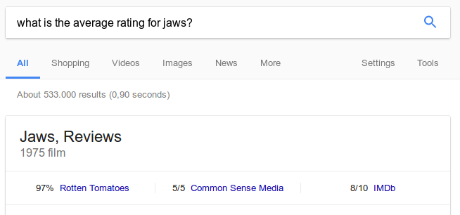
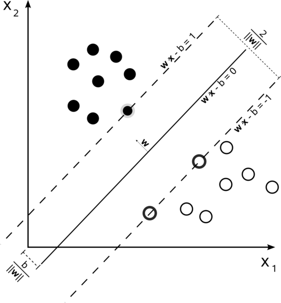
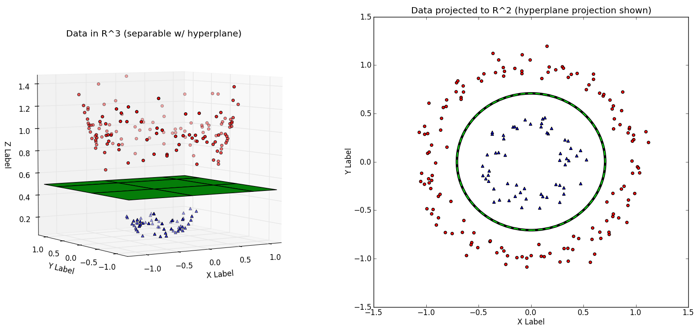

## Working With Text Data - Part II


**Practical Lectures**<br>
by Chris Emmery (MSc)<br>
[`@_cmry`](https://twitter.com/_cmry) &nbsp; • &nbsp; [`@cmry`](https://github.com/cmry)

<style>
body {
    color: #aaa;
}
</style>


### This Lecture

- More issues with text
- Document Classification
  - with Naive Bayes / SVM
  - on Real Example


## Preprocessing Noisy Text


### Naive Text Cleaning

- Lowercasing
- Removing punctuation

```python
import re
text = "I can't watch Marvel's Dr. Horrible.".lower()
re.sub('[^\w ]', '', text)
```

```
i cant watch marvels dr horrible
```


### Finding Tokens

```python
import spacy
nlp = spacy.load('en')
O = "I can't watch Marvel's Dr. Horrible."
W = O.split(' ')
T = [w.text for w in nlp(s)]
```

- <text style="color:#d19a66">O</text>riginal: <br><text style="color:#A2BD40">| I can't watch Marvel's Dr. Horrible. |</text>
- <text style="color:#d19a66">W</text>hitespace: <br><text style="color:#A2BD40">| I | can't | watch | Marvel's | Dr. | Horrible. |</text>
- <text style="color:#d19a66">T</text>okenized: <br><text style="color:#A2BD40">| I | ca | n't | watch | Marvel | 's | Dr. | Horrible | . |</text>


### Word Forms & Lemmas

```python
import spacy
nlp = spacy.load('en')
O = "I was watching Marvel's Dr. Horrible."
L = [w.lemma_ for w in nlp(s)]
```
- <text style="color:#d19a66">O</text>riginal: <br><text style="color:#A2BD40"> I was watching Marvel's Dr. Horrible. </text>
- <text style="color:#d19a66">L</text>emmatized: <br><text style="color:#A2BD40">| -PRON- | be | watch | marvel | 's | dr. | horrible | . |</text>


### Why Tokens and Lemmas?

```python
d1 = "I'm gonna shoot some ball."
d2 = "We shot the ball over the fence."
d3 = "There's many balls in my garden."
```

<small>

| #   | I'm | There's | We | ball | ball. | balls | fence. | garden | garden. | gonna | in | ... |
| --- | ------ | ----- | ----- | --- | ---- | ----- | ----- | ---- | --- | ----- | ---- | ---- | ---- | --- |
| d1  | 1      | 0     | 0     | 0   | 1    | 0     | 0    | 0     | 0   | 1     | 0    | ... |
| d2  | 0      | 0     | 1     | 1   | 0    | 0     | 1    | 1     | 0   | 0     | 0    | ... |
| d3  | 0      | 1     | 0     | 0   | 0    | 1     | 0    | 0     | 1   | 0     | 1    | ... |

vocab length = 18
</small>


### Why Tokens and Lemmas

```python
d1 = "I'm gonna shoot some ball."
d2 = "We shot the ball over the fence."
d3 = "There's many balls in my garden."
```

<small>

| #   | ball   | be    | fence | garden | gon  | in    | many  | na   | over | pron  | shoot | some | the | there |
| --- | ------ | ----- | ----- | ------ | ---- | ----- | ----- | ---- | ---- | ----- | ----- | ---- | --- | ----- |
| d1  | 1      | 1     | 0     | 0      | 1    | 0     | 0     | 1    | 0    | 1     | 1     | 1    | 0   | 0     |
| d2  | 1      | 0     | 1     | 1      | 0    | 0     | 0     | 0    | 1    | 1     | 1     | 0    | 2   | 0     |
| d3  | 1      | 1     | 0     | 1      | 0    | 1     | 1     | 0    | 0    | 1     | 0     | 0    | 0   | 1     |

vocab length = 14

</small>


### Named-Entity Recognition

```python
doc = nlp("It is truly heartbreaking in places, \
           and Benedict Cumberbatch's performance \
           as Alan Turing in The Imitation Game \
           is outstanding.")
[(ent.label_, ent.text) for ent in doc.ents]
```

```
[('PERSON', "Benedict Cumberbatch's"),
 ('PERSON', 'Alan Turing'),
 ('ORG', 'The Imitation Game')]
```

> 1 vocab entry?


### Social Text

```python
text = "lahwd. gurl, u. is. stuuuuupid. smh lllloll. :''))"
[x.lemma_ for x in nlp(mt)]
```

```
['lahwd', '.', 'gurl', ',', 'u.', 'be', '.', 'stuuuuupid',
 '.', 'smh', 'lllloll', '.', ':', "''", ')', ')']
```

```
['lord', '.', 'girl', ',', 'u', 'be', 'stupid',
 '.', 'smh', 'lol', '.', ':'))']
```

> Flooding, slang, misspellings, <br>smiley's / emoji's, spelling variants.


## Document Classification


### Sentiment Analysis

> "an <text style="color:#e06c75">F-</text> for <text style="color:#e06c75">crappy</text> episodes like interdimensional cable which is just <text style="color:#d19a66">bad</text> improv jokes and <text style="color:#d19a66">mediocre</text>"

- Positive / Neutral / Negative
- Highly Positive / Negative
- Negation is important!


### Supervised

- Get data, preferably where strong sentiment shows.
- Hire annotators (or e.g. Mechanical Turk).
- Make them label text with sentiment.
- Represent text as vectors, manual label as target.
- Use patterns in frequencies or weight of words to determine sentiment.


### Distant Supervision

- Get data, preferably where strong sentiment shows.
- Use an indirect signal to measure sentiment (like review scores).
  - We assume that high scores will have positive text.
- Same last two steps.

> Free annotation, more data!


### Challenges

|               |                                                                                                   |
| ------------- | ------------------------------------------------------------------------------------------------- |
| Negation      | "This movie is definitely not <text style="color:#d19a66">bad</text>."                            |
| Dependencies  | "Whoever thinks this film is <text style="color:#e06c75">incredibly bad</text>  is an idiot."     |
| Sarcasm       | "This is the <text style="color:#A2BD40">best movie ever</text>, lol."                            |
| Context       | "This movie is <text style="color:#d19a66">only slightly better</text> than Jaws."                |


### Challenges → Tasks


### Challenges

- [Sarcasm detection](https://deepmoji.mit.edu/).
- World knowledge:




### Applications

- Stock market predictions
- Predicting elections
- Brand monitoring
- Webcare
- (Robot) Journalism


### Let's Build our [Own](http://ai.stanford.edu/~amaas/data/sentiment/)

```python
X = open('./posneg.txt').read()
y = open('./labels.txt').read()
```
```python
from sklearn.feature_extraction.text import CountVectorizer

cv = CountVectorizer()
X = cv.fit_transform(X)

X_train, X_test, y_train, y_test = train_test_split(X, y)
X_train[0]
```
```
<1x74849 sparse matrix of type '<class 'numpy.int64'>'
	with 155 stored elements in Compressed Sparse Row format>
```


### Naive Bayes Classification

```python
from sklearn.naive_bayes import MultinomialNB

nb = MultinomialNB()
nb.fit(X_train, y_train)

ŷ_test = nb.predict(X_test)
```
```python
from sklearn.metrics import classification_report

classification_report(y_test, ŷ_test)
```
```
   precision    recall  f1-score   support

0       0.84      0.88      0.86      3141
1       0.87      0.83      0.85      3109

avg / total       0.86      0.86      0.86      6250
```


### Naive Bayes

$$x = \\langle \text{great}, \text{movie} \\rangle$$

$$P(\text{POS}\ |\ x\_1, x\_2) = P(x\_1\ |\ \text{POS})\ P(x\_2\ |\ \text{POS})\ P(\text{POS})$$

$$P(\text{NEG}\ |\ x\_1, x\_2) = P(x\_1\ |\ \text{NEG})\ P(x\_2\ |\ \text{NEG})\ P(\text{NEG})$$

$$\hat{y} = \arg \max\_y P(y) \prod\_{j=1}^J P(x\_j\ |\ y)$$

> We assume all features contribute independently to the classification, regardless of correlations between the features.


### How-to Naive Bayes

<small>

| $x_1 = \text{bad}$ | $x_2 = \text{great}$ | $x_3 = \text{movie}$ | $y$ |
| ---: | -----: | -----: | ---: |
| 0   | 1     | 1     | 👍   |
| 0   | 1     | 1     | 👍   |
| 0   | 0     | 1     | 👍   |
| 1   | 0     | 1     | 👎   |
| 1   | 0     | 0     | 👎   |

$$P(y\ |\ x\_1, x\_2, x\_3) = P(x\_1\ |\ y)\ P(x\_2\ |\ y)\ P(x\_3\ |\ y)\ P(y)$$

</small>

```
P(bad   ∣ 👍) = 0 / 3    P(bad   ∣ 👎 ) = 2 / 2
P(great ∣ 👍) = 2 / 3    P(great ∣ 👎 ) = 0 / 2
P(movie ∣ 👍) = 3 / 3    P(movie ∣ 👎 ) = 1 / 2
P(👍)         = 3 / 6    P(👎)          = 3 / 6
```

```
D = "bad movie"
P(👍 | D) = P(x1) * P(x3) * P(👍) = 0 / 3 * 3 / 3 * 3/6 = 0.00
P(👎 | D) = P(x1) * P(x3) * P(👎) = 2 / 2 * 1 / 2 * 3/6 = 0.25
```


### Interpreting the Weights

```python
nb.sigma[1]  # averages for class 1 (positive)

sorted(dict(zip(sorted(cv.vocabulary_), nb.sigma_[1])
            ).items(), key=lambda i: i[1], reverse=True)
```
```
 ('just', 0.89990363273941432),
 ('great', 0.86915827641086685),
 ('which', 0.85707581330141391),
 ('if', 0.85072393805169899),
 ('show', 0.84875586445594797),
 ('can', 0.83421992011539459),
 ('story', 0.82831940904629031),
 ('up', 0.81915778385506643),
 ('its', 0.77386614573862367),
 ('well', 0.77291718161570877),
 ('love', 0.74773386977162792),
 ('really', 0.73040541210923116),
```


### SVM - Standard Set-up

```python
from sklearn.svm import LinearSVC

svm = LinearSVC()
svm.fit(X_train, y_train)

ŷ_test = svm.predict(X_test)
classification_report(y_test, ŷ_test)
```
```
    precision    recall  f1-score   support

0       0.88      0.87      0.87      3153
1       0.87      0.88      0.87      3097

avg / total       0.87      0.87      0.87      6250
```


### SVM - Nested Cross-Val

```python
from sklearn.model_selection import GridSearchCV
from sklearn.model_selection import cross_validate

param_grid = [{'C': [1, 10, 100, 1000]}]
# inner CV
clf = GridSearchCV(svm, param_grid, cv=10, n_jobs=-1)  
# outer CV
scores = cross_validate(clf, X_train, y_train, cv=10)  
```

```
{'test_score':
  array([ 0.87846482,  0.86940299,  0.87046908, 0.85866667,
          0.888     ,  0.87306667,  0.87466667, 0.87033084,
          0.86552828,  0.86499466]),
 'train_score':
  array([ 0.99994074,  0.99994074,  1.        ,  1.       ,  
          0.99994074,  1.        ,  1.        ,  1.       ,
          1.        ,  1.        ])}
```


### Testing our Model

```python
D_example_NEG = ["This movie is really really bad."]
d = cv.transform(D_example_NEG)
clf.predict(d)
```
```
array([0])
```

```python
D_example_POS = ["I really loved this movie."]
d = cv.transform(D_example_POS)
clf.predict(d)
```
```
array([1])
```

> Great! Or is it?


### Previous Challenges

```python
D_example_POS = \
  ["This movie is only slightly better than Jaws."]
d = cv.transform(D_example_POS)
clf.predict(d)
```
```
array([0])
```

```python
D_example_NEG = \
  ["I loved this movie as much as my headache."]
d = cv.transform(D_example_NEG)
clf.predict(d)
```
```
array([1])
```

```python
D_example_NEG = ["Best movie ever, not."]
d = cv.transform(D_example_NEG)
clf.predict(d)
```
```
array([1])
```


### What are Support Vector Machines?

Mathematically complex, but two simple intuitions:

- We want our decision boundaries to have an optimal distance from certain groups of classes → use support vectors.
- We want to be able to classify non-linear relations → use kernel trick.


### Support Vectors

<style>
.neg img {
   -webkit-filter: invert(1);
   filter: invert(1);
   }
</style>

<div class="neg">



</div>


### Kernel Trick




## Questions?

> Blackboard → Forum
